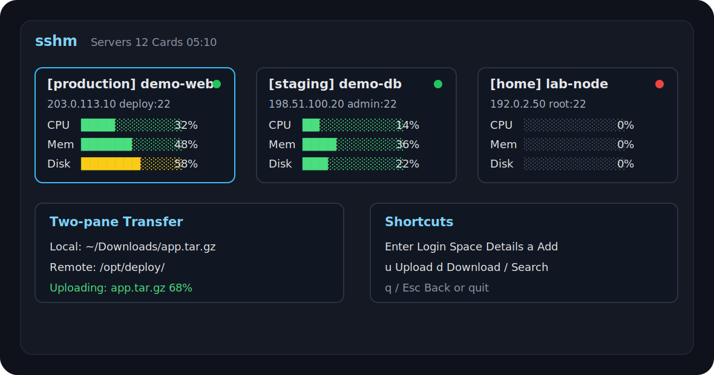

<p align="center">
  
</p>

<h1 align="center">sshm</h1>

<p align="center">
  <strong>全中文终端 SSH 服务器管理器</strong>
  <br>
  监控、登录、分类管理、上传下载，都在一个 TUI 里完成。
</p>

<p align="center">
  <a href="https://github.com/YaMaiDay/sshm/releases"></a>
  <a href="https://github.com/YaMaiDay/sshm"></a>
  <a href="#-平台支持"></a>
  <a href="#-执照"></a>
</p>

<p align="center">
  <a href="#-安装">安装</a> ·
  <a href="#-快速开始">快速开始</a> ·
  <a href="#-核心功能">功能</a> ·
  <a href="https://github.com/YaMaiDay/sshm/releases">下载</a> ·
  <a href="#-安全边界">安全边界</a>
</p>

---

## ✨ 为什么用 sshm

`sshm` 适合想一直待在终端里管理服务器的人。它不会内置远程 shell，登录时直接调用系统 `ssh`，并把真实终端交给 SSH 进程，所以远程 Tab 补全、vim、tmux、Ctrl+C、删除键都保持原生体验。

| 你以前可能这样 | 现在可以这样 |
| --- | --- |
| 到处找服务器 IP、端口、用户名 | 在 TUI 里统一添加和分类 |
| 登录后手动执行 `top`、`df`、`free` | 主面板直接看 CPU、内存、磁盘、负载 |
| 手写复杂 `scp` 命令 | 双栏选择本地/远程路径后上传下载 |
| 编辑多个 SSH 或密码文件 | 统一保存到 `~/.config/sshm/servers.toml` |

## ⚡ 安装

### macOS / Linux

```sh
curl -fsSL https://raw.githubusercontent.com/YaMaiDay/sshm/main/install.sh | sh
```

macOS 上如果存在 Homebrew 目录，默认会安装到 `/opt/homebrew/bin/sshm`；其他 macOS / Linux 环境默认安装到 `/usr/local/bin/sshm`。可以用 `SSHM_INSTALL_DIR` 覆盖。

### Windows PowerShell（测试阶段）

```powershell
irm https://raw.githubusercontent.com/YaMaiDay/sshm/main/install.ps1 | iex
```

安装完成后运行：

```sh
sshm
```

查看当前版本：

```sh
sshm --version
```

如果之前用过本地开发版 alias，当前终端可能还会指向旧路径。可以重新打开终端，或执行：

```sh
unalias sshm 2>/dev/null || true
hash -r
```

<details>
<summary>其他安装方式</summary>

指定安装目录：

```sh
curl -fsSL https://raw.githubusercontent.com/YaMaiDay/sshm/main/install.sh | SSHM_INSTALL_DIR="$HOME/.local/bin" sh
```

安装指定版本：

```sh
curl -fsSL https://raw.githubusercontent.com/YaMaiDay/sshm/main/install.sh | SSHM_VERSION=vX.Y.Z sh
```

Windows 指定安装目录：

```powershell
$env:SSHM_INSTALL_DIR="$HOME\bin"; irm https://raw.githubusercontent.com/YaMaiDay/sshm/main/install.ps1 | iex
```

Windows 安装指定版本：

```powershell
$env:SSHM_VERSION="vX.Y.Z"; irm https://raw.githubusercontent.com/YaMaiDay/sshm/main/install.ps1 | iex
```

使用 Go 安装：

```sh
go install github.com/YaMaiDay/sshm/cmd/sshm@latest
```

手动下载：

```text
https://github.com/YaMaiDay/sshm/releases
```

Releases 页面会提供各平台二进制包和 `checksums.txt` 校验文件。

</details>

## ⌨️ 快速开始

```sh
sshm
```

第一次打开后，按 `a` 添加服务器。添加服务器时左边填写服务器信息，右边管理分类，`Tab` 切换左右区域，`Enter` 保存。

```text
导航    ↑↓←→
登录    Enter        详情    Space
详情    ↑↓/jk 滚动   q/Esc 返回
管理    a 添加       e 编辑       x 删除
传输    u 上传       d 下载
视图    / 搜索       t 分类       o 在线       p 异常       s 排序
刷新    r
返回    q / Esc
```

## 🚀 核心功能

|  | 功能 | 状态 |
| --- | --- | --- |
| 🖥️ | 全中文 TUI 监控面板 | ✅ 已支持 |
| 🗂️ | 服务器分类管理 | ✅ 已支持 |
| ✏️ | 添加、编辑、删除服务器 | ✅ 已支持 |
| 📊 | CPU / 内存 / Swap / 磁盘 / inode / 负载 / 运行时间 | ✅ 已支持 |
| 🔬 | 详情页展示 CPU 型号、核心数、内核、架构、文件系统 | ✅ 已支持 |
| 🐳 | Docker 容器数量和异常服务提示 | ✅ 已支持 |
| 🔎 | 搜索、筛选、排序、手动刷新 | ✅ 已支持 |
| 🔐 | 系统 `ssh` 登录 | ✅ 已支持 |
| ⌨️ | 原生终端交互，支持 Ctrl+C / 删除键 / Tab | ✅ 已支持 |
| 🔕 | 自动隐藏 OpenSSH post-quantum 警告 | ✅ 已支持 |
| 📁 | 双栏文件选择器 | ✅ 已支持 |
| ⬆️⬇️ | 文件和目录上传/下载 | ✅ 已支持 |
| 🔑 | 密码、密钥、跳板机 | ✅ 已支持 |
| 🔄 | 从 OpenSSH 配置迁移 | ✅ 已支持 |
| 🧪 | Windows 完整体验 | 🧪 实验性 |

## 📦 依赖

`sshm` 本身是单个 Go 二进制，但部分能力依赖系统命令：

| 依赖 | 用途 |
| --- | --- |
| `ssh` | 登录服务器、采集监控信息 |
| `scp` | 上传和下载文件 |
| `sshpass` | 密码登录，非必需但建议安装 |

macOS：

```sh
brew install hudochenkov/sshpass/sshpass
```

Debian / Ubuntu：

```sh
sudo apt install openssh-client sshpass
```

## 🗂️ 文件位置

一键安装只安装程序本体，服务器配置会保存在用户目录里。

| 类型 | macOS / Linux | Windows |
| --- | --- | --- |
| 程序本体 | macOS Homebrew 环境默认 `/opt/homebrew/bin/sshm`，其他环境默认 `/usr/local/bin/sshm`，也可自定义安装目录 | `%LOCALAPPDATA%\Programs\sshm\sshm.exe` 或自定义安装目录 |
| 服务器配置 | `~/.config/sshm/servers.toml` | `%USERPROFILE%\.config\sshm\servers.toml` |
| 应用配置 | `~/.config/sshm/config.toml` | `%APPDATA%\sshm\config.toml` |

打开配置目录：

```sh
open ~/.config/sshm
```

查看服务器配置：

```sh
cat ~/.config/sshm/servers.toml
```

## ⚙️ 配置

服务器数据保存在：

```text
~/.config/sshm/servers.toml
```

<details>
<summary>查看 servers.toml 示例</summary>

```toml
categories = ["production", "staging"]

[[servers]]
category = "production"
name = "demo-web"
host = "203.0.113.10"
user = "deploy"
port = 22
key_path = "~/.ssh/id_ed25519"
proxy_jump = ""
password = ""

[[servers]]
category = "staging"
name = "demo-db"
host = "198.51.100.20"
user = "admin"
port = 22
key_path = ""
proxy_jump = ""
password = "example-password"
```

</details>

认证方式自动判断：

- `key_path` 不为空时使用密钥
- `password` 不为空时允许 `password` 和 `keyboard-interactive` / PAM
- `key_path` 和 `password` 同时存在时，允许 `publickey,password,keyboard-interactive`
- 两者都为空时交给系统 OpenSSH、ssh-agent 或默认配置处理

应用配置保存在：

```text
~/.config/sshm/config.toml
```

<details>
<summary>查看 config.toml 示例</summary>

```toml
refresh_interval = "5s"
connect_timeout = "2s"
command_timeout = "6s"

local_dirs = [".", "~/Downloads", "~/Desktop", "~/Documents", "~"]
remote_dirs = ["$HOME", "/home", "/opt", "/var/www", "/data", "/tmp"]
```

</details>

## 🔄 数据迁移

如果 `servers.toml` 不存在，首次启动会尝试从这些旧配置迁移：

```text
~/.ssh/config
~/.ssh/config.d/*
~/.ssh/passwords.txt
~/.ssh/passwords/<host>
```

迁移后，添加、编辑、删除、登录、监控、上传和下载都以 `servers.toml` 为准。保存配置时会直接覆盖 `servers.toml`，不会自动生成 `.bak` 备份文件。

## 🖥️ 登录体验

登录服务器时，`sshm` 会临时让出终端控制权，直接运行系统 `ssh` 或 `sshpass ssh`，并强制分配交互式 TTY。

这意味着进入服务器后：

- `Ctrl+C` 会中断远程命令
- 删除键、方向键、Tab 补全按远程 shell 的规则工作
- `vim`、`top`、`htop`、`tmux` 等交互式程序按正常 SSH 方式运行
- 退出远程服务器后会回到 `sshm` 面板

如果本机 OpenSSH 支持 `WarnWeakCrypto`，`sshm` 会自动隐藏下面这类 post-quantum 提示：

```text
WARNING: connection is not using a post-quantum key exchange algorithm
```

连接失败、认证失败、网络错误等正常错误仍会显示。

## 📡 监控方式

`sshm` 通过 SSH 执行远程只读命令采集 Linux 服务器状态，不安装 agent，不修改服务器配置。

| 默认策略 | 值 |
| --- | --- |
| 自动刷新 | 每 5 秒一轮 |
| SSH 连接超时 | 2 秒 |
| 单台采集超时 | 6 秒 |
| 离线判断 | 在线服务器连续失败 2 次后显示离线 |

主面板显示短进度条，方便快速扫 CPU、内存、磁盘使用率和容量。详情页会展示更完整的资源信息，包括 CPU 核心数和型号、内核、架构、内存可用量、Swap、根分区文件系统、磁盘可用量和 inode 使用情况。详情内容超出窗口高度时，可以用 `↑↓` 或 `j/k` 上下滚动。

采集内容包括 `/proc/stat`、`/proc/loadavg`、`/proc/cpuinfo`、`free`、`df`、`uname`、`uptime`、`systemctl --failed`、`docker ps`、`ss` 或 `netstat`。

## 📁 文件传输

| 操作 | 流程 |
| --- | --- |
| 上传 | 选择服务器 -> 按 `u` -> 左侧选择本地文件/目录 -> 右侧选择远程目录 -> `Space` 开始 |
| 下载 | 选择服务器 -> 按 `d` -> 左侧选择远程文件/目录 -> 右侧选择本地目录 -> `Space` 开始 |

底层调用系统 `scp`，支持文件和目录。传输过程中按 `q` / `Esc` / `Ctrl+C` 退出 `sshm` 时，会主动中断正在运行的上传或下载子进程。

## 💻 平台支持

| 平台 | 状态 |
| --- | --- |
| macOS | ✅ 推荐 |
| Linux | ✅ 推荐 |
| Windows Terminal + OpenSSH | 🧪 实验性 |

Windows 目前可编译运行，但本地路径选择和 `sshpass` 体验没有 macOS/Linux 完整。

## 🧭 设计取舍

| 项目 | 说明 |
| --- | --- |
| 开发语言 | Go |
| 交互语言 | 中文优先 |
| SSH 登录 | 调用系统 `ssh` |
| 远程 shell | 不内置，保留原生终端体验 |
| 远程依赖 | 不安装 agent |
| 文件传输 | 调用系统 `scp` |

## 🛠️ 开发

拉取源码：

```sh
git clone https://github.com/YaMaiDay/sshm.git
cd sshm
```

```sh
go test ./...
go run ./cmd/sshm
go build -o sshm ./cmd/sshm
go run ./cmd/sshm --version
```

常用调试命令：

```sh
go run ./cmd/sshm --list
go run ./cmd/sshm --probe demo-web
go run ./cmd/sshm --remote-dirs demo-web
go run ./cmd/sshm --config-path
```

<details>
<summary>源码结构</summary>

```text
sshm/
├── cmd/sshm/main.go              # CLI 入口
├── internal/actions/             # SSH 登录、上传下载动作
├── internal/config/              # 配置读取、迁移、服务器管理
├── internal/fsselect/            # 本地/远程文件选择
├── internal/host/                # 服务器数据结构
├── internal/monitor/             # SSH 监控采集与指标解析
├── internal/tui/                 # Bubble Tea TUI 界面
├── assets/preview.svg            # README 预览图
├── install.sh                    # macOS / Linux 安装脚本
├── install.ps1                   # Windows 安装脚本
└── README.md
```

</details>

## 🔒 安全边界

`sshm` 默认只做本地配置管理和远程只读监控。

不会做的事：

- 不安装服务器 agent
- 不修改远程 `sshd_config`
- 不自动关闭密码登录
- 不上传密钥
- 不默认扫描 `/root`
- 不内置远程 shell

密码保存在本机 `servers.toml` 中，文件权限设置为 `600`。这只是个人工具的便利设计，不等同于加密保险箱。

## 📄 执照

Apache 2.0 — 请参阅 [LICENSE](LICENSE)。

---

<p align="center">
  由 <a href="https://github.com/YaMaiDay">YaMaiDay</a> 用心制作 ❤️
</p>

<p align="center">
  ⭐ 如果你觉得这个仓库有用，请给它点个星！ ⭐
</p>
