<h1 align="center">sshm</h1>

<p align="center">
  <strong>A local-first terminal SSH server manager.</strong>
  <br>
  Monitor servers, open SSH sessions, transfer files, run commands, manage resources, and deploy apps through a TUI built on OpenSSH and rsync.
</p>

<p align="center">
  <a href="https://github.com/YaMaiDay/sshm/releases"></a>
  <a href="https://github.com/YaMaiDay/sshm/actions/workflows/release.yml"></a>
  <a href="https://github.com/YaMaiDay/sshm/actions/workflows/codeql.yml"></a>
  <a href="https://github.com/YaMaiDay/sshm"></a>
  <a href="#installation"></a>
  <a href="LICENSE"></a>
</p>

<p align="center">
  <a href="#installation">Installation</a> ·
  <a href="#quick-start">Quick Start</a> ·
  <a href="#features">Features</a> ·
  <a href="#documentation">Documentation</a> ·
  <a href="https://github.com/YaMaiDay/sshm/releases">Downloads</a>
</p>

<p align="center">
  
</p>

## Installation

macOS / Linux:

```sh
curl -fsSL https://raw.githubusercontent.com/YaMaiDay/sshm/main/install.sh | sh
```

Windows PowerShell:

```powershell
irm https://raw.githubusercontent.com/YaMaiDay/sshm/main/install.ps1 | iex
```

Run:

```sh
sshm
```

The install script downloads the matching package from GitHub Releases and verifies it with the same-version `checksums.txt`.

Manual install is also supported: download the archive for your platform from [Releases](https://github.com/YaMaiDay/sshm/releases), verify it with that release's `checksums.txt`, extract it, and run `sshm`.

## Quick Start

1. Run `sshm`.
2. Press `a` to add a server.
3. Fill in name, host, user, port, authentication, category, and optional health ports.
4. Press `Enter` to save.
5. Use the dashboard to monitor, log in, run commands, transfer files, manage resources, or deploy apps.

Common dashboard keys:

| Key | Action |
| --- | --- |
| `?` | Show full shortcut help |
| `Enter` | Open SSH for the selected server |
| `Space` | Open server details |
| `/` | Search |
| `Tab` / `←` / `→` | Switch category |
| `a` / `c` / `e` / `x` | Add, copy, edit, or delete server |
| `m` / `b` / `i` | Command templates, batch commands, command history |
| `u` / `d` / `y` | Upload, download, transfer jobs |
| `n` | Resource manager |
| `g` | App deployments |
| `w` | Anomaly overview |
| `z` / `s` | Switch dashboard view or sort |
| `t` / `f` / `v` | Pin, favorite, favorites-only |
| `o` / `p` | Online-only or problems-only filter |
| `r` | Refresh monitoring |
| `.` | Settings |

## Features

| Area | What sshm does |
| --- | --- |
| Dashboard | Card, group, category, and narrow-screen server layouts |
| Monitoring | CPU, memory, mounted disks, load, swap, inode, Docker, services, health ports, and risk hints |
| SSH | Uses the system `ssh`, preserving the native terminal experience |
| Bastion | Supports private servers through OpenSSH `ProxyJump`; private keys stay local |
| Commands | Command templates, batch commands, and local command history |
| Transfer | `rsync` upload/download jobs with multi-select, progress, pause, resume, and history |
| Resources | Docker containers, systemd services, processes, ports, databases, logs, filters, custom commands, and confirmed actions |
| Deployment | Git and GitHub Release based app deployments with stages, history, queues, and rollback |
| Server Data | Categories, rename, pin, favorite, notes, expiration dates, server copy, and OpenSSH config migration |

## CLI

Most usage happens in the TUI, but these command-line helpers are available:

```sh
sshm --list
sshm --probe demo-web
sshm --probe production/demo-web
sshm --remote-dirs demo-web
sshm --config-path
sshm --version
```

See [Common Workflows](docs/common-workflows.md) for details.

## Installed Files

sshm installs one executable. Your servers, settings, resources, deployments, transfers, and history are stored separately under your user data directory, so upgrading the binary keeps your data.

| Platform | Default executable |
| --- | --- |
| macOS Apple Silicon | `/opt/homebrew/bin/sshm` |
| macOS Intel | `/usr/local/bin/sshm` |
| Linux | `/usr/local/bin/sshm` |
| Windows | `%LOCALAPPDATA%\Programs\sshm\sshm.exe` |

Set `SSHM_INSTALL_DIR` to install the executable somewhere else.

Common user data files:

| Path | Description |
| --- | --- |
| `~/.config/sshm/config.toml` | App settings |
| `~/.config/sshm/servers.toml` | Servers, categories, pins, favorites, and bastion references |
| `~/.config/sshm/commands.toml` | Command templates |
| `~/.config/sshm/history.toml` | Command execution history |
| `~/.config/sshm/transfers.toml` | Transfer jobs and history |
| `~/.config/sshm/deployments.toml` | Deployment apps and records |
| `~/.config/sshm/resources.toml` | Resource favorites, pins, custom commands, and database connection fields |
| `~/.config/sshm/resource_cache.toml` | Cached resource discovery results |
| `~/.config/sshm/state.toml` | Local state such as last login time |

To back up or move sshm, copy `~/.config/sshm/`. On Windows, app settings may use `%APPDATA%\sshm\config.toml`; other user data uses `%USERPROFILE%\.config\sshm\`.

## Documentation

| Document | Description |
| --- | --- |
| [Common Workflows](docs/common-workflows.md) | Dashboard keys, command-line flags, and common daily flows |
| [Deployment](docs/deployment.md) | Git and GitHub Release deployment, credentials, queues, history, and rollback |
| [Resources](docs/resources.md) | Containers, services, processes, ports, databases, actions, logs, and cache behavior |
| [Troubleshooting](docs/troubleshooting.md) | SSH, bastion, monitoring, rsync, GitHub, deployment, resources, and database issues |
| [Remote Script Security](docs/remote-script-security.md) | Generated scripts, user-provided commands, quoting, and regression coverage |
| [Security Policy](SECURITY.md) | Security boundaries, sensitive data, reporting, and local files |
| [Changelog](CHANGELOG.md) | User-visible release notes |
| [GitHub Wiki](https://github.com/YaMaiDay/sshm/wiki) | Public documentation index |

## Dependencies

| Command | Purpose |
| --- | --- |
| `ssh` | Login, monitoring, commands, resources, and deployment |
| `rsync` | Upload/download and local-fetch deployment |
| `sshpass` | Optional password-login automation |

macOS:

```sh
brew install hudochenkov/sshpass/sshpass
```

Debian / Ubuntu:

```sh
sudo apt install openssh-client rsync sshpass
```

Windows:

- OpenSSH Client should be available in Windows Settings or on `PATH`.
- File transfer requires an `rsync` executable available on `PATH`, for example through Git for Windows, MSYS2, Cygwin, WSL, or another compatible package.

Remote servers also need `rsync` for file transfer and local-fetch deployment. If a remote server is missing `rsync`, sshm asks before attempting installation.

## Security, Privacy, And Network Behavior

sshm is a local SSH management tool. It has no telemetry, does not check for updates in the background, and does not report server data to project infrastructure.

sshm does not upload private keys, passwords, server lists, command history, transfer history, or deployment records. It does not install a remote agent and does not modify remote `sshd_config`.

Network access happens only when the user installs sshm, connects to configured servers, runs commands, transfers files, deploys apps, fetches configured release resources, or confirms remote `rsync` installation.

## License

Apache 2.0. See [LICENSE](LICENSE).

[Report a bug or request a feature](https://github.com/YaMaiDay/sshm/issues/new/choose) ·
[Join discussions](https://github.com/YaMaiDay/sshm/discussions)
