<h1 align="center">sshm</h1>

<p align="center">
  <strong>全中文终端 SSH 服务器管理器</strong>
  <br>
  一个 TUI 面板：看监控、进 SSH、传文件、跑命令。
</p>

<p align="center">
  <a href="https://github.com/YaMaiDay/sshm/releases"></a>
  <a href="https://github.com/YaMaiDay/sshm/actions/workflows/release.yml"></a>
  <a href="https://github.com/YaMaiDay/sshm/actions/workflows/codeql.yml"></a>
  <a href="https://github.com/YaMaiDay/sshm"></a>
  <a href="#-安装"></a>
  <a href="LICENSE"></a>
</p>

<p align="center">
  <a href="#-安装">安装</a> ·
  <a href="#-功能">功能</a> ·
  <a href="https://github.com/YaMaiDay/sshm/wiki">文档</a> ·
  <a href="https://github.com/YaMaiDay/sshm/releases">下载</a>
</p>

<p align="center">
  
</p>

---

## ⚡ 安装

macOS / Linux：

```sh
curl -fsSL https://raw.githubusercontent.com/YaMaiDay/sshm/main/install.sh | sh
```

Windows PowerShell：

```powershell
irm https://raw.githubusercontent.com/YaMaiDay/sshm/main/install.ps1 | iex
```

运行：

```sh
sshm
```

安装脚本会从 GitHub Releases 下载对应系统和架构的安装包，并自动使用同版本 `checksums.txt` 校验 SHA256。

### 手动下载与校验

不想使用安装脚本时，可以到 [Releases](https://github.com/YaMaiDay/sshm/releases) 手动下载对应系统的压缩包，并下载同一版本里的 `checksums.txt`。

macOS / Linux 校验示例：

```sh
shasum -a 256 sshm_v*_darwin_arm64.tar.gz
cat checksums.txt
```

Windows PowerShell 校验示例：

```powershell
Get-FileHash .\sshm_v*_windows_amd64.zip -Algorithm SHA256
type .\checksums.txt
```

确认本地文件的 SHA256 和 `checksums.txt` 中对应文件一致后，再解压使用。Release 同时提供 `sbom.spdx.json` 依赖清单，并启用 GitHub Artifact Attestations 用于查看构建来源。

## ✨ 功能

|  |  |
| --- | --- |
| 🖥️ | 全中文 TUI，卡片/分组/分类视图，窄屏自适应 |
| 📊 | CPU、内存、磁盘、负载、Swap、inode |
| 🐳 | Docker、监听端口、健康检查、异常服务 |
| 🔐 | 调用系统 `ssh`，保留原生终端体验 |
| 🛡️ | 成功/失败登录摘要，SSH 风险提示 |
| 🧰 | 命令模板、批量命令、命令历史 |
| 📁 | 文件和目录上传/下载，支持多选、任务列表、进度、暂停继续 |
| 🗂️ | 分类、置顶、收藏、备注、到期时间、复制服务器 |
| 🔄 | 从 OpenSSH 配置迁移 |

## 🚀 常用场景

|  |  |
| --- | --- |
| 🧑‍💻 | 多台服务器：分类、置顶、收藏、搜索 |
| 📊 | 看状态：CPU、内存、磁盘、容器 |
| 🔐 | `Enter` 直接登录服务器 |
| 🧰 | `m` 命令模板，`b` 批量执行 |
| 📁 | `u` / `d` 上传下载文件或目录，`y` 查看传输任务 |
| 🛡️ | 看失败登录和 SSH 风险 |

## 📁 传输任务

sshm 使用 `rsync` 进行文件传输，适合较大的文件和目录。

|  | 说明 |
| --- | --- |
| ✅ | 可一次选择多个文件或目录创建上传/下载任务 |
| 📊 | 任务卡片显示状态、方向、路径、进度、速度和错误 |
| ⏸️ | 支持暂停、中断后继续，保留半成品用于断点续传 |
| 🧾 | 保留传输历史，已完成/失败/取消记录最多保存 100 条 |
| 🧭 | 传输中可以返回首页，任务会继续运行 |
| 🚪 | 退出 sshm 时，正在运行的传输会被标记为中断 |

## 🧭 使用

```text
1. 运行 sshm
2. 按 a 添加服务器
3. Enter 保存
4. 在主面板查看监控、登录、传文件、跑命令
```

## 📦 依赖

| 命令 | 用途 |
| --- | --- |
| `ssh` | 登录、监控采集 |
| `rsync` | 上传/下载、断点续传 |
| `sshpass` | 密码登录，可选 |

macOS：

```sh
brew install hudochenkov/sshpass/sshpass
```

Debian / Ubuntu：

```sh
sudo apt install openssh-client rsync sshpass
```

远程服务器也需要 `rsync`。如果远程缺少 `rsync`，sshm 会提示用户确认是否尝试安装；没有权限时会直接提示安装失败，不会静默修改服务器。

## 📁 配置

| 文件 | 作用 |
| --- | --- |
| `~/.config/sshm/servers.toml` | 服务器 |
| `~/.config/sshm/commands.toml` | 命令模板 |
| `~/.config/sshm/history.toml` | 命令历史 |
| `~/.config/sshm/transfers.toml` | 传输任务和历史 |
| `~/.config/sshm/config.toml` | 应用配置 |

<details>
<summary>更多配置说明</summary>

Windows 配置目录：

```text
%USERPROFILE%\.config\sshm\servers.toml
%USERPROFILE%\.config\sshm\commands.toml
%USERPROFILE%\.config\sshm\history.toml
%APPDATA%\sshm\config.toml
```

认证逻辑：

- 有 `key_path`：只用当前服务器密钥。
- 有 `password`：允许密码和 PAM。
- 密钥和密码都有：先密钥，后密码。
- 都没有：交给系统 OpenSSH / ssh-agent。

常用字段：

```toml
category = "production"
name = "demo-web"
host = "203.0.113.10"
user = "deploy"
port = 22
key_path = "~/.ssh/id_ed25519"
note = "线上 Web 入口"
expire_at = "2026-08-31"
favorite = true
pinned = true
pinned_order = 1
health_ports = [80, 443, 8080]
```

</details>

## 🔒 安全、隐私与联网行为

sshm 是本地运行的 SSH 管理工具，不包含遥测，不会在后台连网检查更新，也不会向项目服务器上报服务器信息。

|  | 说明 |
| --- | --- |
| 🌐 | 运行时不会自动访问 GitHub 检查更新 |
| 📊 | 不包含遥测、数据统计或崩溃上报 |
| 🛰️ | 不在后台访问 GitHub 或项目方服务器 |
| 📡 | 不上传服务器列表、IP、用户名、路径、命令历史或传输历史 |
| 🚫 | 不安装服务器 agent |
| 🧱 | 不修改远程 `sshd_config` |
| 🔑 | 不上传密钥 |
| 🗂️ | 不默认扫描 `/root` |
| 🔐 | 登录直接调用系统 `ssh` |
| 📁 | 文件传输直接在本机和目标服务器之间通过 `rsync` 进行 |

密码保存在本机 `servers.toml` 中，文件权限设置为 `600`。

会主动联网的场景只有：

- 用户运行 `install.sh` / `install.ps1` 安装脚本时，会访问 GitHub Releases 下载程序。
- 用户确认远程安装 `rsync` 时，会在远程服务器上调用系统包管理器。
- 用户主动连接自己的服务器、执行命令、上传或下载文件。

## 📄 执照

Apache 2.0 — 请参阅 [LICENSE](LICENSE)。

---

### ⭐ 如果这个项目对你有用，欢迎点一个 Star！⭐

[报告问题](https://github.com/YaMaiDay/sshm/issues/new) ·
[提出功能建议](https://github.com/YaMaiDay/sshm/issues/new) ·
[参与讨论](https://github.com/YaMaiDay/sshm/discussions)
